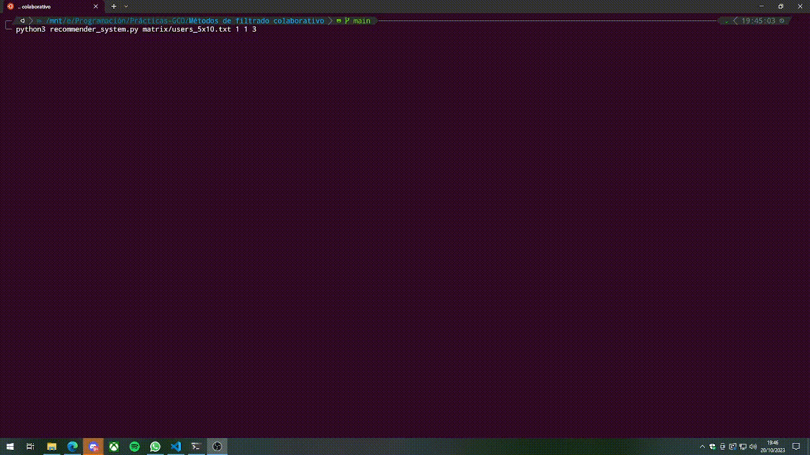

# Sistema de Recomendación - Métodos de filtrado colaborativo

Este es un sistema de recomendación que utiliza tres métricas diferentes y dos métodos de predicción para predecir las valoraciones de los usuarios. El sistema está diseñado para ayudar a los usuarios a encontrar recomendaciones basadas en sus preferencias y datos de entrada.

## Descripción

Este programa es un sistema recomendador que utiliza métricas para predecir la valoración de un usuario. Toma un archivo de datos de entrada (archivo.txt) que contiene información sobre las valoraciones de los usuarios y utiliza varias métricas y métodos de predicción para ofrecer recomendaciones personalizadas.

Las métricas que se pueden utilizar son las siguientes:
  - Correlación de Pearson
  - Distancia Coseno
  - Distancia Euclídea

Las predicciones que se pueden utilizar son las siguientes:
  - Predicción Simple
  - Diferencia con la media

## Requisitos

El sistema de recomendación requiere la instalación de las siguientes bibliotecas de Python:

- [tabulate](https://pypi.org/project/tabulate/): Para formatear y mostrar datos en forma de tabla.
- [termcolor](https://pypi.org/project/termcolor/): Para agregar color a la salida de la consola.

Puedes instalar estas bibliotecas utilizando pip:

```shell
pip install tabulate termcolor
```

## Ejecución

Para ejecutar el sistema de recomendación, sigue estos pasos:

1. Abre una terminal.

2. Ejecuta el programa recommender_system.py con la siguiente manera con los argumentos pertinentes:

```shell
python recommender_system.py <nombre_archivo>.txt <tipo_métrica> <tipo_predicción> <número_vecinos>
```

3. La salida del sistema se mostrará en la consola y estará formateada como tablas con colores.

## Argumentos

1. ```<nombre_archivo>.txt```: El archivo que contiene los datos de entrada para el sistema recomendador.

2. ```<tipo_métrica>```: El tipo de métrica que se debe utilizar (**1** para **Correlación de Pearson**, **2** para **Distancia Coseno**, **3** para **Distancia Euclídea**).

3. ```<tipo_predicción>```: El tipo de predicción que se debe utilizar (**1** para **Predicción Simple**, **2** para Diferencia con la media).

4. ```<número_vecinos>```: El número de vecinos a considerar en el cálculo de las recomendaciones.

## Ejemplo de Ejecución



